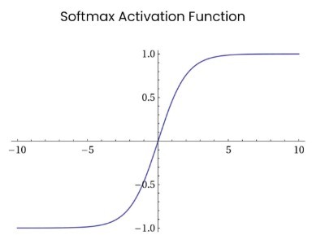
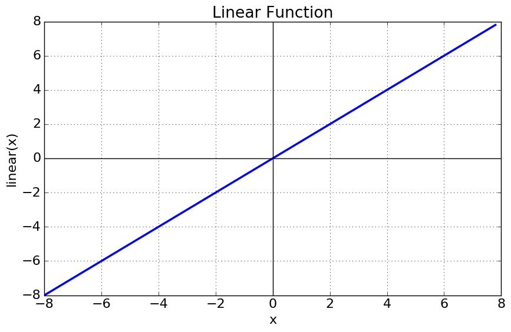

# NeuroFox


## 📄 İçindekiler

1. [Veri Üretim Fonksiyonları](#veri-üretim-fonksiyonları)
2. [Sinir Ağı Katmanları](#sinir-ağı-katmanları)
3. [Aktivasyon Fonksiyonları](#aktivasyon-fonksiyonları)
4. [Düzenleme Katmanları](#düzenleme-katmanları)
5. [Yoğun Katman (Dense Layer)](#yoğun-katman-dense-layer)
6. [Kayıp Fonksiyonları](#kayıp-fonksiyonları)
7. [Sinir Ağı Sınıfı](#sinir-ağı-sınıfı)
8. [Optimizatörler](#optimizatörler)
9. [Öğrenme Oranı Zamanlayıcı](#öğrenme-oranı-zamanlayıcı)
10. [Yardımcı Araçlar](#yardımcı-araçlar)
11. [Örnek Kullanım](#örnek-kullanım)

---

## 📂 Proje Özeti

Bu proje, çeşitli sinir ağı bileşenlerini ve optimizasyon tekniklerini içeren bir sinir ağı uygulaması sunar. Proje, ikili sınıflandırma ve çeşitli aktivasyon fonksiyonlarını kullanarak performans analizleri yapar.

## 📂 Proje Dosya Yapısı

Bu proje şu dosya yapısına sahiptir:

```
NeuroFox/
│
├── assets/
│   ├── linear_activation.png         # Lineer aktivasyon fonksiyonunun grafiği
│   ├── logo.png                      # Proje logosu
│   ├── relu_activation.png           # ReLU aktivasyon fonksiyonunun grafiği
│   ├── sigmoid_activation.png        # Sigmoid aktivasyon fonksiyonunun grafiği
│   └── softmax_activation.jpg        # Softmax aktivasyon fonksiyonunun grafiği
│
├── data/
│   ├── __init__.py                   # data modülünü tanımlayan dosya
│   └── data.py                       # Veri üretim fonksiyonlarının bulunduğu dosya
│
├── layers/
│   ├── __init__.py                   # layers modülünü tanımlayan dosya
│   ├── dense.py                      # Yoğun (Dense) katman sınıfını içeren dosya
│   ├── dropout.py                    # Dropout düzenleme katmanını içeren dosya
│   ├── layer.py                      # Temel katman sınıfını içeren dosya
│   └── activations/                  # Aktivasyon fonksiyonları
│       ├── __init__.py               # activations modülünü tanımlayan dosya
│       ├── linear.py                 # Lineer aktivasyon fonksiyonunu içeren dosya
│       ├── relu.py                   # ReLU aktivasyon fonksiyonunu içeren dosya
│       ├── sigmoid.py                # Sigmoid aktivasyon fonksiyonunu içeren dosya
│       └── softmax.py                # Softmax aktivasyon fonksiyonunu içeren dosya
│
├── losses/
│   ├── __init__.py                   # losses modülünü tanımlayan dosya
│   ├── binary_crossentropy.py        # İkili çapraz entropi kayıp fonksiyonunu içeren dosya
│   ├── binary_focal_loss.py          # İkili focal kayıp fonksiyonunu içeren dosya
│   └── categorical_crossentropy.py   # Kategorik çapraz entropi kayıp fonksiyonunu içeren dosya
│
├── neural_network/
│   ├── __init__.py                   # neural_network modülünü tanımlayan dosya
│   └── neural_network.py             # Sinir ağı yapısını tanımlayan dosya
│
├── optimizers/
│   ├── __init__.py                   # optimizers modülünü tanımlayan dosya
│   ├── adagrad_optimizer.py          # Adagrad optimizasyon algoritmasını içeren dosya
│   ├── adam_optimizer.py             # Adam optimizasyon algoritmasını içeren dosya
│   ├── learning_rate_scheduler.py    # Öğrenme oranı zamanlayıcısını içeren dosya
│   ├── rmsprop_optimizer.py          # RMSprop optimizasyon algoritmasını içeren dosya
│   └── sgd_optimizer.py              # Stokastik Gradient Descent (SGD) optimizasyon algoritmasını içeren dosya
│
├── utils/
│   ├── __init__.py                   # utils modülünü tanımlayan dosya
│   ├── binary_classification.py      # İkili sınıflandırma verilerini üreten araçlar
│   ├── model_utils.py                # Modelle ilgili çeşitli yardımcı fonksiyonlar
│   ├── one_hot_encoding.py           # Tekil sıcak kodlaması (one-hot encoding) fonksiyonu
│   ├── standart_scaler.py            # Veriyi standartlaştıran fonksiyon
│   └── train_test_split.py           # Eğitim ve test setlerine veri ayırma fonksiyonu
│
├── binary_classification_model.py    # İkili sınıflandırma modeli örneği
├── iris_dataset_model.py             # IRIS veri seti ile model örneği
├── xor_model.py                      # XOR veri seti ile model örneği
└── README.md                         # Proje hakkında genel bilgi, kurulum ve kullanım talimatları
```

### Dosya Açıklamaları

- **`assets/`**: Proje ile ilgili görsel dosyaların bulunduğu dizin. Aktivasyon fonksiyonlarının formüllerinin görsel temsilleri bu dizindedir.
- **`data/`**: Modeli test etmek ve eğitim verisi üretmek için gerekli fonksiyonları içeren dosyalar.
- **`layers/`**: Sinir ağı katmanları ve aktivasyon fonksiyonlarını içeren dosyalar. Ayrıca aktivasyon fonksiyonlarının ayrıntıları burada yer alır.
- **`losses/`**: Kayıp fonksiyonları ve bu fonksiyonlara ilişkin implementasyonlar.
- **`neural_network/`**: Sinir ağı modelinin yapı taşlarını tanımlayan dosyalar.
- **`optimizers/`**: Farklı optimizasyon algoritmalarını ve öğrenme oranı zamanlayıcılarını içeren dosyalar.
- **`utils/`**: Veri işleme, model yönetimi ve diğer yardımcı araçlar için fonksiyonlar.
- **`README.md`**: Proje hakkında genel bilgi, kurulum talimatları, kullanım detayları ve örnekler.


### 1. **Veri Üretim Fonksiyonları**

#### **`create_xor_data(num_samples)`**
İkili sınıflandırma görevleri için XOR verisi oluşturur.

- **Kullanım**:
  ```python
  X, y = create_xor_data(1000)
  ```

- **Parametreler**:
  -  `num_samples` (int): Oluşturulacak veri noktalarının sayısı.
- **Döndürenler**: 
  - `X`: Girdi özellikleri
  - `y`: Etiketler

#### **`create_binary_classification_data(samples=1000, noise=0.1)`**
Gürültü ekleme seçeneği ile ikili sınıflandırma verisi oluşturur.

- **Kullanım**:
  ```python
  X, y = create_binary_classification_data(samples=1000, noise=0.1)
  ```

- **Parametreler**:
  - `num_samples` (int): Oluşturulacak veri noktalarının sayısı.
- **Döndürenler**: 
  - `X`: Girdi özellikleri
  - `y`: Etiketler

### 2. **Sinir Ağı Katmanları**

#### **`Layer`**
Sinir ağı içindeki tüm katmanlar için temel sınıf.


### 3. **Aktivasyon Fonksiyonları**

#### **`ActivationSoftmax`**
Girdi üzerine Softmax aktivasyon fonksiyonunu uygular.

- **Softmax Formülü**:
  - $$\text{Softmax}(z_i) = \frac{e^{z_i}}{\sum_{j=1}^K e^{z_j}}$$

- 

#### **`ActivationSigmoid`**
Girdi üzerine Sigmoid aktivasyon fonksiyonunu uygular.

- **Sigmoid Formülü**:
  -  $$\sigma(x) = \frac{1}{1 + e^{-x}}$$

- 

#### **`ActivationReLU`**
Girdi üzerine ReLU aktivasyon fonksiyonunu uygular.

- **ReLU Formülü**:
  -  $$\text{ReLU}(x) = \max(0, x)$$

- 

#### **`ActivationLinear`**
Girdi üzerine lineer aktivasyon fonksiyonunu uygular (değişiklik yapmaz).

- **Lineer Formül**:
  - $$f(x) = x$$

- 

### 4. **Düzenleme Katmanları**

#### **`Dropout(rate=0.5)`**
Dropout düzenlemesini uygular.

- **Kullanım**: 
  ```python
  dropout_layer = Dropout(rate=0.5)
  ```

- **Parametreler**:
  - `rate` (float): Atılacak giriş birimlerinin oranı.

### 5. **Yoğun Katman (Dense Layer)**

#### **`Dense(input_size, output_size)`**
Sinir ağı içinde tam bağlantılı bir katman.

- **Kullanım**: 
  ```python
  dense_layer = Dense(input_size=128, output_size=64)
  ```

- **Parametreler**:
  - `input_size` (int): Girdi özelliklerinin sayısı.
  - `output_size` (int): Çıktı özelliklerinin sayısı.

### 6. **Kayıp Fonksiyonları**

#### **`BinaryCrossentropy`**
İkili çapraz entropi kaybını hesaplar.

- **Formül**:
  -  $$L = -\frac{1}{N}\sum_{i=1}^{N} [y_i \log(\hat{y}_i) + (1-y_i) \log(1-\hat{y}_i)]$$


#### **`CategoricalCrossentropy`**
Kategorik çapraz entropi kaybını hesaplar.

- **Formül**:
  -  $$L = -\sum_{i=1}^{N} y_i \log(\hat{y}_i)$$


#### **`BinaryFocalLoss(gamma=2, alpha=0.25)`**
İkili focal kaybı hesaplar, genellikle sınıf dengesizliğini ele almak için kullanılır.

- **Formül**:
  - $$\text{FL}(p_t) = -\alpha_t (1 - p_t)^\gamma \log(p_t)$$

- **Parametreler**:
  - `gamma` (float): Odaklanma parametresi.
  - `alpha` (float): Ağırlıklandırma faktörü.


### 7. **Sinir Ağı Sınıfı**

#### **`NeuralNetwork`**
Esnek bir sinir ağı oluşturma ve eğitme sınıfı.

- **Yöntemler**:
  - `add_layer(layer)`: Modele bir katman ekler.
  - `add_activation(activation)`: Modele aktivasyon ekler.
  - `add_dropout(dropout)`: Modele Dropout ekler.
  - `set_batch_size(batch_size)`: Batch_size'ı ayarlamak için kullanılır.
  - `compile(optimizer, loss)`: Modele belirli bir optimizatör ve kayıp fonksiyonu ile derler.
  - `fit(X, y, epochs)`: Modeli eğitir.
  - `predict(X)`: Eğitilmiş model ile tahminler yapar.
  
  - **`evaluate(x_test, y_test)`**: Modelin test verisi üzerindeki performansını değerlendirir.
    - **Kullanım**:
      ```python
      loss, accuracy = model.evaluate(x_test, y_test)
      ```
    - **Parametreler**:
      - `x_test` (numpy array): Test girdi verileri.
      - `y_test` (numpy array): Test etiketleri.
    - **Döndürenler**:
      - `loss`: Test verisi üzerindeki kayıp değeri.
      - `accuracy`: Test verisi üzerindeki doğruluk oranı.

  - **`summary()`**: Modelin katman yapısını ve parametre sayısını özetler.
    - **Kullanım**:
      ```python
      model.summary()
      ```
    - **Açıklama**:
      - Modelin tüm katmanlarını, her bir katman için parametre sayısını ve toplam parametre sayısını gösterir. Bu, modelin genel yapısını anlamak ve modelin karmaşıklığını değerlendirmek için kullanılır.

### 8. **Optimizatörler**

#### **`AdamOptimizer(learning_rate=0.001, beta1=0.9, beta2=0.999, epsilon=1e-7)`**
Adam optimizasyon algoritmasını uygular.

- **Formül**:
  $$m_t = \beta_1 m_{t-1} + (1 - \beta_1)g_t$$
  $$v_t = \beta_2 v_{t-1} + (1 - \beta_2)g_t^2$$
  $$\theta_t = \theta_{t-1} - \frac{\eta \cdot m_t}{\sqrt{v_t} + \epsilon}$$


#### **`SGDOptimizer(learning_rate=0.01)`**
Stokastik Gradient Descent optimizasyonunu uygular.

- **Formül**:
  -  $$\theta = \theta - \eta \cdot \nabla_{\theta} J(\theta)$$

#### **`RMSpropOptimizer(learning_rate=0.001, beta=0.9, epsilon=1e-7)`**
RMSprop optimizasyon algoritmasını uygular.

- **Formül**:
  - $$\mathcal{E}^{g \circ g}_{t+1} = \beta_2 \cdot \mathcal{E}^{g \circ g}_t + (1 - \beta_2) \cdot (g_t \circ g_t)$$

  - $$\theta_{t+1} = \theta_t - \frac{\eta \cdot g_t}{\sqrt{\mathcal{E}^{g \circ g}_{t+1} + \epsilon}}$$


### 9. **Öğrenme Oranı Zamanlayıcı**

#### **`LearningRateScheduler(initial_lr=0.01, decay=0.1, drop_period=10)`**
Öğrenme oranını zamanla azaltan bir zamanlayıcı.

- **Formül**:
    $$\mathcal{lr}_t = \mathcal{initial\_lr} \cdot \frac{1}{1 + \mathcal{decay} \cdot \frac{\mathcal{epoch}}{\mathcal{drop\_period}}}$$

- **Parametreler**:
  - `initial_lr` (float): Başlangıç öğrenme oranı.
  - `decay` (float): Azalma oranı.
  - `drop_period` (int): Öğrenme oranını azaltma dönemi.

### 10. **Yardımcı Araçlar**

#### **`train_test_split(X, y, test_size=0.2)`**
Veri setini eğitim ve test alt kümelerine böler.

- **Kullanım**:
  ```python
  X_train, X_test, y_train, y_test = train_test_split(X, y, test_size=0.2)
  ```
- **Parametreler**:
  - `X` (numpy array): Girdi özellikleri.
  - `y` (numpy array): Etiketler.
  - `test_size` (float): Test setinin oranı. Varsayılan değer 0.2'dir, yani veri setinin %20'si test setine ayrılır.
- **Döndürenler**:
  - `X_train`: Eğitim verisi.
  - `X_test`: Test verisi.
  - `y_train`: Eğitim etiketleri.
  - `y_test`: Test etiketleri.

#### **`save_model(model, filename)`**
Eğitilmiş bir modeli belirtilen dosya adıyla kaydeder.

- **Kullanım**:
  ```python
  save_model(model, 'model.pkl')
  ```
- **Parametreler**:
  - `model`: Kaydedilecek model.
  - `filename` (str): Modelin kaydedileceği dosya adı.

#### **`load_model(filename)`**
Kaydedilmiş bir modeli belirtilen dosyadan yükler.

- **Kullanım**:
  ```python
  model = load_model('model.pkl')
  ```
- **Parametreler**:
  - `filename` (str): Yüklenecek model dosyasının adı.
- **Döndürenler**:
  - `model`: Yüklenen model.

#### **`standard_scaler(X)`**
Veri setini standartlaştırır, yani verilerin ortalamasını 0 ve standart sapmasını 1 olacak şekilde ölçeklendirir.

- **Kullanım**:
  ```python
  scaler = StandardScaler()
  X = scaler.fit_transform(X)
  ```
- **Parametreler**:
  - `X` (numpy array): Standartlaştırılacak veriler.
- **Döndürenler**:
  - `X_scaled`: Standartlaştırılmış veri.

#### **`one_hot_encoding(y)`**
Sınıf etiketlerini tekil sıcak kodlaması (one-hot encoding) ile dönüştürür.

- **Kullanım**:
  ```python
  y_one_hot = one_hot_encoding(y, num_classes=3)
  ```
- **Parametreler**:
  - `y` (numpy array): Dönüştürülecek sınıf etiketleri.
- **Döndürenler**:
  - `y_encoded`: Tekil sıcak kodlaması yapılmış etiketler.

#### **`classify(X)`**
Eğitilmiş bir modeli kullanarak tahminler yapar.

- **Kullanım**:
  ```python
  output = classify(predictions)
  ```
- **Parametreler**:
  - `model`: Tahmin yapmak için kullanılan eğitilmiş model.
  - `X` (numpy array): Girdi özellikleri.
- **Döndürenler**:
  - `predictions`: Modelin tahminleri.

### 11. **Örnek Kullanımlar**
XOR verisetine ait çıktılarını detaylı bir şekilde görmek için, bu depodaki [dosyasına](xor_model.py) dosyasına göz atabilirsiniz.
IRIS verisetine ait çıktılarını detaylı bir şekilde görmek için, bu depodaki [dosyasına](iris_dataset_model.py) dosyasına göz atabilirsiniz.
Binary Classification verisetine ait çıktılarını detaylı bir şekilde görmek için, bu depodaki [dosyasına](binary_classification_model.py) dosyasına göz atabilirsiniz.
